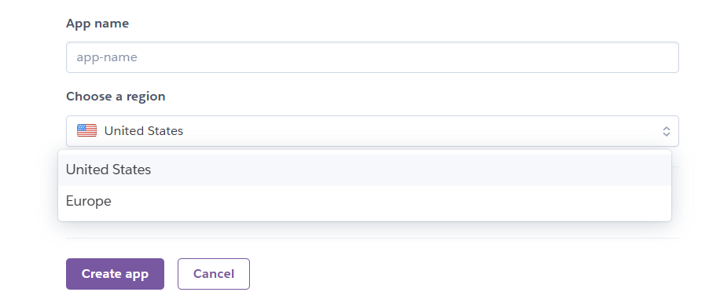
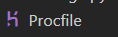
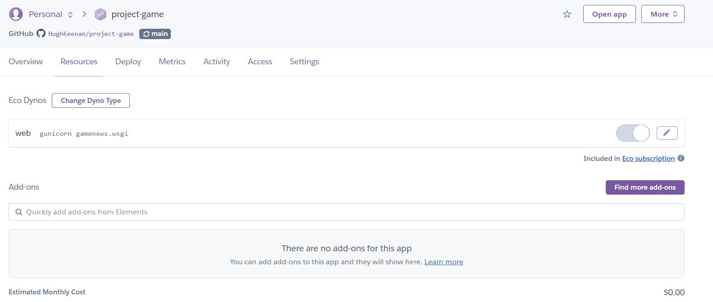
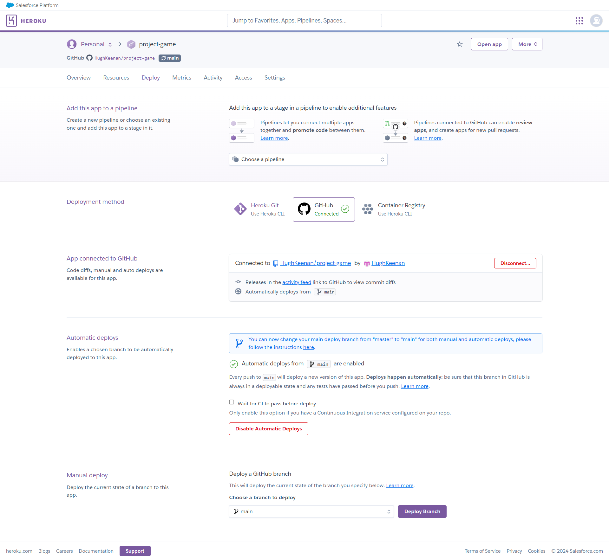

# Deployment

+ This app was deployed to Heroku

## Local Deployment

Using your repository, open a workspace in Gitpod

1. Install dependencies:

+ Open the terminal window and type: pip3 install -r requirements.txt

2. Create a .gitignore file in the root directory of the project. Add env.py and pycache files to ensure data privacy

3. Create a .env file. This will contain the following environment variables:

    ```
    python
    import os

      os.environ['SECRET_KEY'] = 'Choose your secret key'
      os.environ['DATABASE_URL'] = 'URL to connect to the database'
      os.environ['DEBUG'] = 'True'
    ```

+ During development DEBUG is set to True, but must be changed to False before final deployment.

4. Create your database using https://dbs.ci-dbs.net/ 

+ You will receive a database key in an email after creating this. Post this to your env.py file

5. To make migrations on updates to models, run the following in the terminal
    ```
        python3 manage.py makemigrations
        python3 manage.py migrate
    ```

6. Create a superuser to access the admin environment.
    ```
        python3 manage.py createsuperuser
    ```
+ Enter the requested information (username, email and password).

7. Run the app with the following command in the terminal:
    ```
        python3 manage.py runserver
    ```

8. Open the provided link in browser to see your app.

To access the admin environment:

Add /admin/ to the home link.
Enter the superuser's username and password.

## Heroku Deplyoment

+ Go to www.heroku.com 

+ Log in or create a new account.

+ Create a new app.


+ Name the app (the app must have aunique name) and select the appropriate region for your location (Europe or America).

     

+ Use the terminal command pip3 install gunicorn ~20.1 and freeze to your requirements.txt by typing pip3 freeze local > requirements.txt in the terminal.

+ Create a Procfile in your workspace



+ The procfile must contain the following:
    ```
        web: gunicorn <app_name>.wsgi
    ```

+ In the project's settings.py file, ensure Debug=False and add '.herokuapp.com' to the list of ALLOWED_HOSTS

+ Navigate to the resources tab in your heroku app and ensure you are using an eco Dyno, and remove any Postgres database add-ons



+ In the app's settings tab, open Config Vars 

+ Ensure the config vars are as follows:
| Key|Value|
|--|--|
| DATABASE_URL | <CI postgres database url> | 
| DISABLE_COLLECTSTATIC | 1 |
| SECRET_KEY | <your choice of secret key> |

+ ensure your DATABASE_URL and SECRET_KEY have been included in your env.py file 

+ Commit any changes made and push to Github

+ Go into your app in Heroku, open the Deploy tab. search for your github repository at the bottom of the page and connect it to the app. Manually deploy the app from the main branch using the deploy branch button. You can also at this point set up automatic deploys so an up to date version will deploy every time you push to github.



+ Ahead of final deployment, set debug to False locally and delete DISABLE_COLLECTSTATIC from config vars. Then commit and push the changes to GitHub. If you have not set up automatic deploys, manually deploy one final time
