The site has the following pages:
+ Thread list (home page)
+ Thread content
+ Register
+ Login
+ Logout
+ About Us
+ Report User

Access to pages according to user role:

|Page Name|Unregistered user|Regsitered User|
|--|--|--|
|Thread list|Full access|Full Access|
|Thread content|Can read but not respond|Can read, can respond, update and delete responses|
|Register|Full access|Full Access|
|Login|Can access but not use until account is made|Full access|
|Logout|Full access|Full Access|
|About Us|Full access|Full Access|
|Report User|No access|Full Access|

### Navbar
Each page has a navbar. The navbar looks as follows to a user who is unregistered/not signed in:

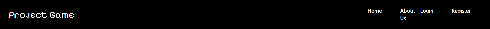

The buttons on it are as follows:

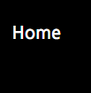

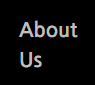

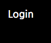

It looks as follows to a user who is signed in:

And it has the following buttons:

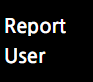

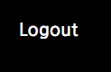

On smaller screens the navbar is collapsed

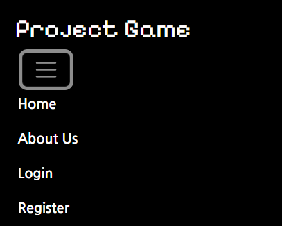

The Navbar also displays the site's name and logo, which doubles as a link to the homepage

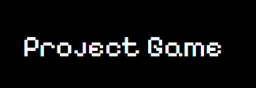

### Footer
Each page also has a footer. The footer contains the creator's name, along with icons for instagram, facebook and youtube, which act as links to those sites opening in new tabs. In the case of a professionally used site would link to the site's profile on each platform. The footer layout does not change depending on screen size.

### Register
If the user does not already have an account, they can sign up for one using the register link in the navbar. Doing so will bring them to this page:

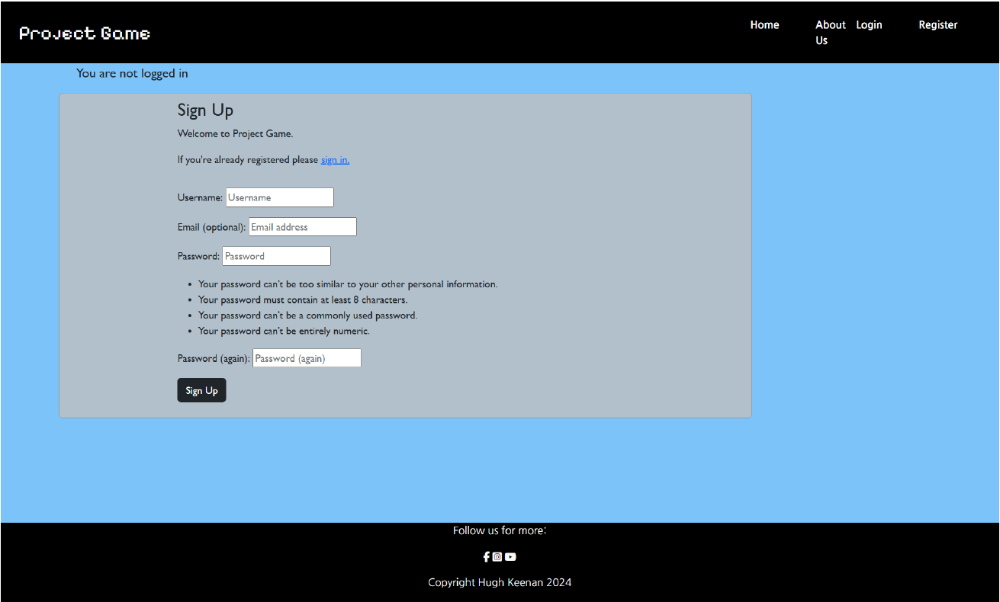

If the user already has an account, they can use this link to redirect to the sign in page:

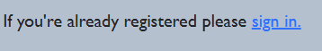

The username, password and password (again) fields are required to set up an account.

If the user tries to register a username that is already taken, the following message will appear:

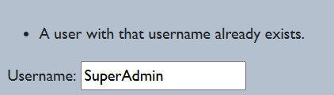

If they try to submit without entering a username, the following error message will appear:

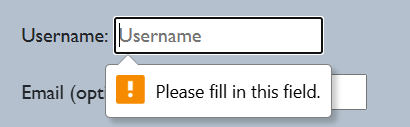

If they try to submit without entering a password, the following error message will appear

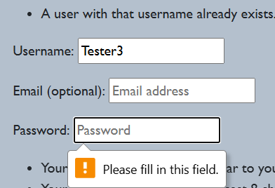

If they try to submit without repeating the password, they will see the following:

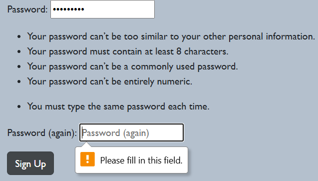

If the submitted passwords don't match, they will see the following:

### Thread list
The homepage is the most recent entries in the list of threads that makes up the site's content. This was designed to have a clean, uncomplicated look which was inspired by sites like Reddit and the forum pages on Escapistmagazine, with a list of threads prominently displayed with clearly legible titles. It does not change depending on login status. Each entry displays the title and username of the person who posted it, along with the date of post.

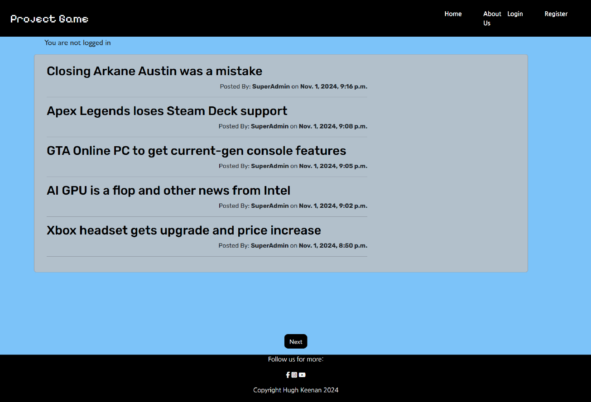

At the bottom of the page, there are buttons that can be used to navigate to older entries. When in the page of older entries, the button marked Next will change to Previous, and when there are 3 pages or more, the two buttons will appear side by side when not on the first or last page.

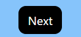

### Thread Content
From the homepage, one can click on the title of any thread to view its contents. The view presented will depend on the status of the user.

Users who are not signed in will see the following:

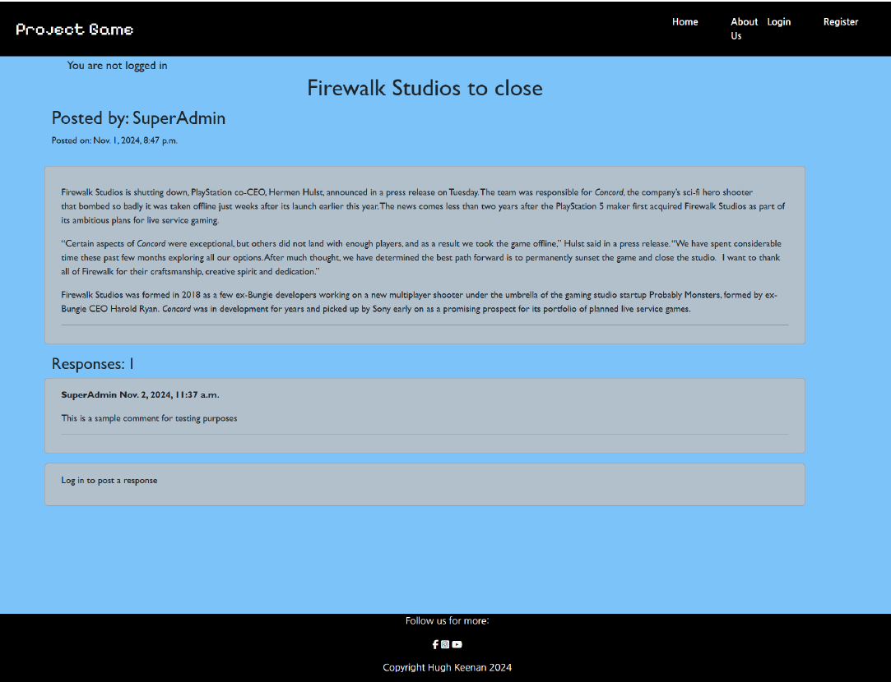

A user must be authenticated before being allowed to respond to threads. A user who is signed in will see the following:

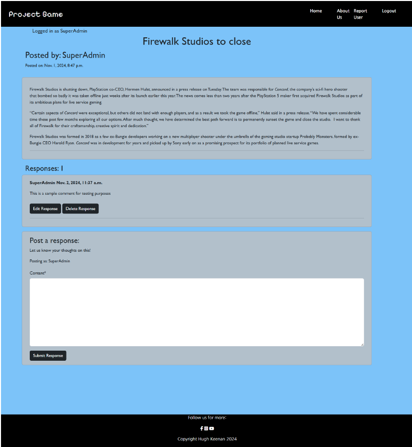

The user may fill out a response in the form and post with the submit button. On posting a response, it will appear beneath the thread, along with the options to edit or delete it. The counter of responses will also increment up.

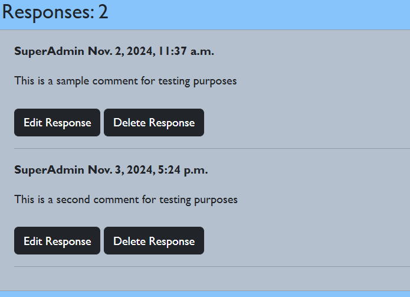

The user will also receive a message to say that they have posted

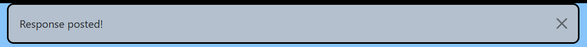

If the user decides to update by pressing the update button below the form, the response form will repopulate with the text of their response. The button below will also change to say update.

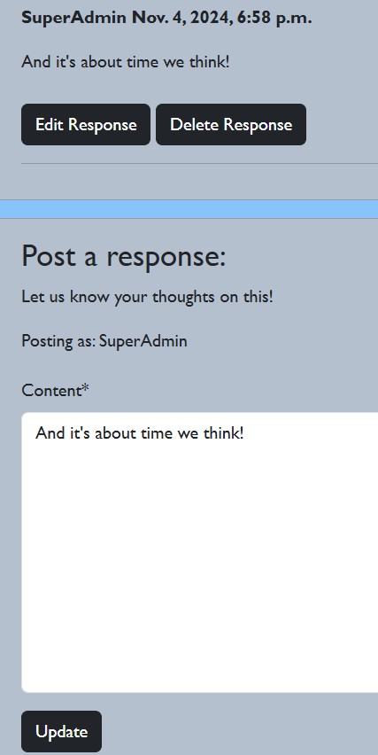

Any updates will be posted in their original position.

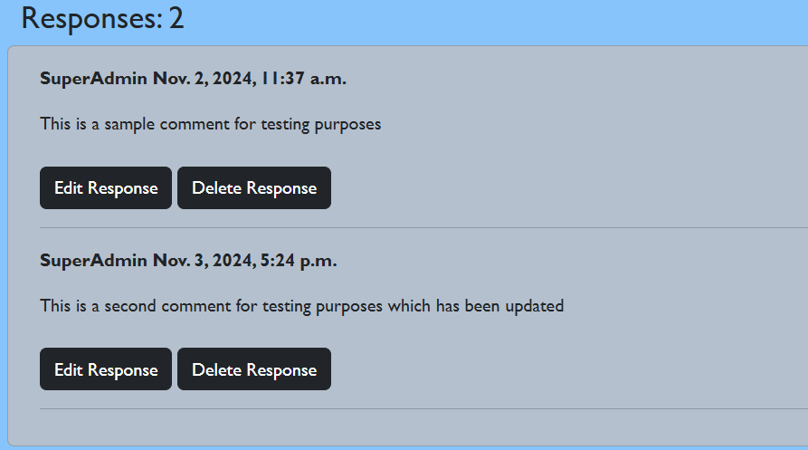

And a message will be displayed

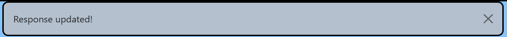

If the user chooses to delete, a modal asking for confirmation will appear

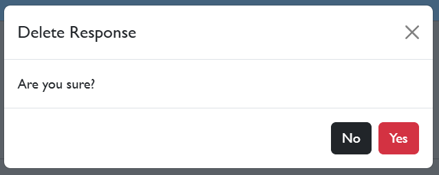

The user may choose to cancel, in which case the page view will be unchanged. If they choose to delete, the response in question will be removed and the counter will decrement

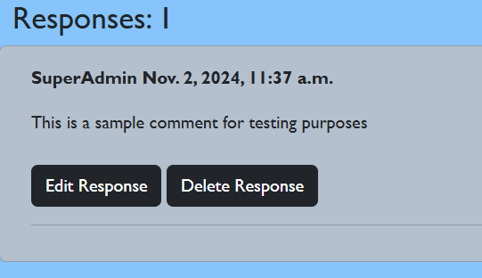

A message will also display.

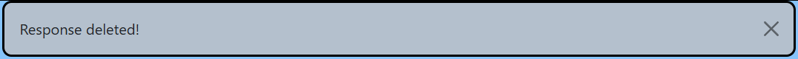

### About Us
This is an entry in the thread list intended to function as a page to explain to new users the purpose of the site. It can be accessed by scrolling through the list like any other thread, but it was decided that having a dedicated link would be a better user experience. As it's a thread like the others, it shares all of the functions mentioned in the thread content section

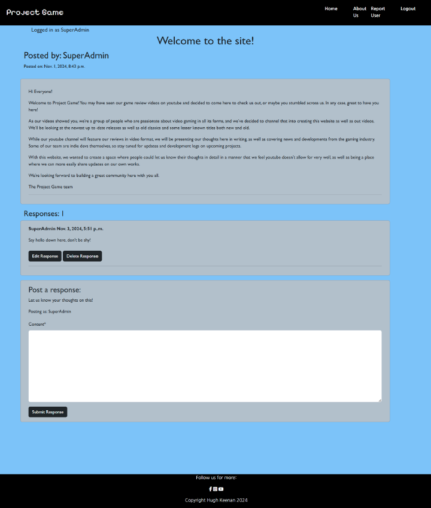