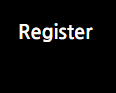
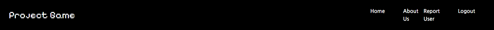

The site has the following pages:
+ Thread list (home page)
+ Thread content (content page for a given thread)
+ Register
+ Login
+ Logout
+ About Us
+ Report User

Access to pages according to user role:

|Page Name|Unregistered user|Regsitered User|
|--|--|--|
|Thread list|Full access|Full Access|
|Thread content|Can read but not respond|Can read, can respond, update and delete responses|
|Register|Full access|Full Access|
|Login|Can access but not use until account is made|Full access|
|Logout|Full access|Full Access|
|About Us|Full access|Full Access|
|Report User|No access|Full Access|

### Navbar
Each page has a navbar. The navbar looks as follows to a user who is unregistered/not signed in:

The buttons on it are as follows:

It looks as follows to a user who is signed in:

And it has the following buttons:

On smaller screens the navbar is collapsed

The Navbar also displays the site's name and logo, which doubles as a link to the homepage

### Footer
Each page also has a footer. The footer contains the creator's name, along with icons for instagram, facebook and youtube, which act as links to those sites opening in new tabs. In the case of a professionally used site would link to the site's profile on each platform. The footer layout does not change depending on screen size.

### Register
If the user does not already have an account, they can sign up for one using the register link in the navbar. Doing so will bring them to this page:

If the user already has an account, they can use this link to redirect to the sign in page:

The username, password and password (again) fields are required to set up an account.

If the user tries to register a username that is already taken, the following message will appear:

If they try to submit without entering a username, the following error message will appear:

If they try to submit without entering a password, the following error message will appear

If they try to submit without repeating the password, they will see the following:

If the submitted passwords don't match, they will see the following:

### Thread list
The homepage is the most recent entries in the list of threads that makes up the site's content. This was designed to have a clean, uncomplicated look which was inspired by sites like Reddit and the forum pages on Escapistmagazine, with a list of threads prominently displayed with clearly legible titles. It does not change depending on login status. Each entry displays the title and username of the person who posted it, along with the date of post.

At the bottom of the page, there are buttons that can be used to navigate to older entries. When in the page of older entries, the button marked Next will change to Previous, and when there are 3 pages or more, the two buttons will appear side by side when not on the first or last page.

### Thread Content
From the homepage, one can click on the title of any thread to view its contents. The view presented will depend on the status of the user.

Users who are not signed in will see the following:

A user must be authenticated before being allowed to respond to threads. A user who is signed in will see the following:

The user may fill out a response in the form and post with the submit button. On posting a response, it will appear beneath the thread, along with the options to edit or delete it. The counter of responses will also increment up.

The user will also receive a message to say that they have posted

If the user decides to update by pressing the edit button below their response, the response form will repopulate with the text of their response. The button below will also change to say update.

Any updates will be posted in their original position.

And a message will be displayed

If the user chooses to delete, a modal asking for confirmation will appear

The user may choose to cancel, in which case the page view will be unchanged. If they choose to delete, the response in question will be removed and the counter will decrement

A message will also display.

### About Us
This is an entry in the thread list intended to function as a page to explain to new users the purpose of the site. It can be accessed by scrolling through the list like any other thread, but it was decided that having a dedicated link would be a better user experience. As it's a thread like the others, it shares all of the functions mentioned in the thread content section

### Login
Users who already have an account can use this page to sign in to the site.

If the user doesn't have an existing account they can redirect to the register page using this link:

If the user attempts to sign in without a username, they will get the following error:

If the user attempts to sign in without a password, they will receive the following error:

If the user uses an incorrect password, they will see the following:

If the user signs in successfully, they will be redirected to the home page and receive amessage like the following, updated for their username:

### Logout
Signed in users can use this to log out of the site by clicking the Sign out button.

If they sign out they will be redirected to the home page and they will receive a notifcation

### Report User

This page is available to users to report others for inappropriate behaviour on the site. By clicking the Report User button in the navbar, this will open in a separate window. It was decided that opening it in a new window would be better as it means the user can more easily refer to what they wish to report without having to reset the report form.

The form requires specific data types in order to be submitted successfully. If the user attempts to submit the form with blank fields or data that doesn't match the required type, they will see an error message like this one:

If the user submits the for correctly, the page will refresh and the report form will be blank, in case they wish to submit another. They will receive the following message:

## Admin Features
This site is dependent on input from the superusers, who can post new content from the admin page, accessed by appending '/admin' to the homepage url

### Post threads
Superusers can post new threads to the site. This is accessed by the Threads option in the admin menu

By selecting New thread in the top left, a new one can be posted

Once saved, this will appear in the list of threads, and at the top of the list on the front end, and may be accessed and interacted with like any other thread

Existing threads can also be edited by selecting them from the list and changing the text using the summernote editor

Posted threads can also be deleted by selecting them in the list and choosing to delete in the dropdown menu.

### Reports

The report guidelines can be updated in much the same way as a thread by selecting reports from the list in the main admin page and then selecting the report entry

To view submitted reports, select Report Users. The title is visible, as is the status of whether or not it has been looked at yet. 

By selecting it, the superuser can review it and once satisfied, change the status to examined

This will update it in the list.

And it can then be deleted in the same manner as a thread.

While this is being examined, comments that have been reported on can be rendered invisible while the admin decides what to do.

This is done by selecting a response from the list under Responses, the same manner as a thread. Once viewing the details, the comment can be disabled by unchecking the 'Visible' box. This is to ensure that anything unsuitable can be hidden while still being retained in case authorities need to be contacted.

This is the view before the check:

And after:

Once the response has been rendered invisible, reported users can have their accounts disabled. To do this, select users from the menu and then the profile of the specific user being reported. Once in there, the Active box can be unchecked, at which point the user will be unable to log in until it is unchecked. Users can then be deleted if necessary. Any responses will remain on the database, again in case they contain anything requiring further investigation.

