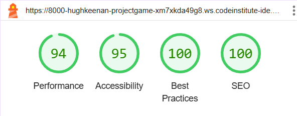
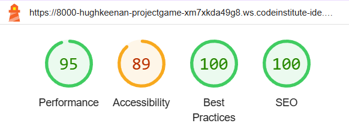
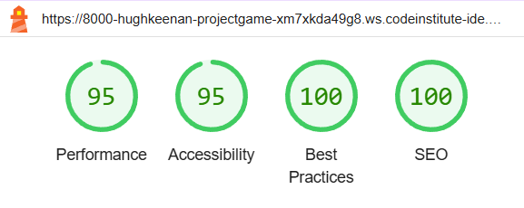
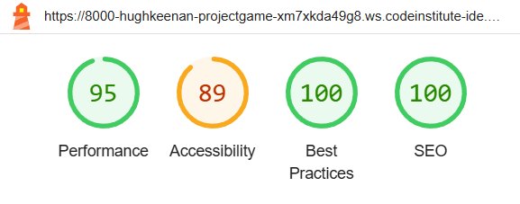
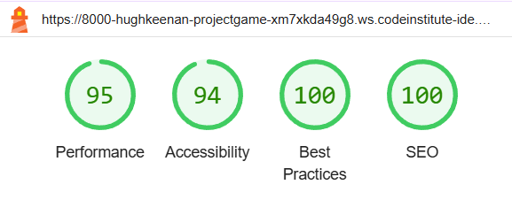
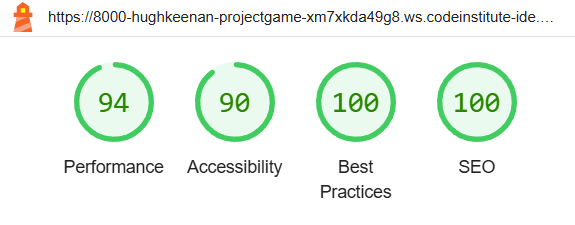
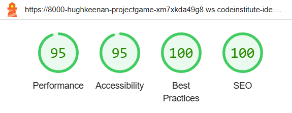

# Testing
## Manual Testing
Manual testing of features was conducted as they were added. However, once principal work on the project was completed, formalised manual testing of all features was conducted  to ensure full functionality.

Navigation between pages
|Feature|User Action|Expected Outcome|Expected Outcome achieved|Comments|
|--|--|--|--|--|
|Logo as homepage button|Click on site logo|Return to beginning of thread list|Yes|N/A|
|Home link|Click on Home link|Return to beginning of thread list|Yes|N/A|
|About Us Link|Click on About Us link|Open first thread entry which explains sit purpose|Yes|N/A|
|Register Link|Click on Register link|Open page to register for new account|Yes|N/A|
|Sign In link|Click on Sign in link|Open page to sign in existing user|Yes|N/A|
|Sign Out link|Click on Sign out link|Open page to sign out|Yes|N/A|
|Report User link|Click on report user link|Open page to report user in new tab|Yes|N/A|
|Next/Previous buttons|Click on Previous/Next button to move between pages of thread titles|Move to earlier entries on clicking next and more recent ones on clicking previous|Yes|N/A|
|Thread title as link|Click on thread title to read contents|Open content of the selected thread|Yes|N/A|
|Access Admin page as superuser|append admin to homepage url|open admin page|Yes|N/A|
|Access Admin page as non-superuser|append admin to homepage url|rejected with message the non-superuser can't access|Yes|N/A|

Create accounts
|Feature|User Action|Expected Outcome|Expected Outcome achieved|Comments|
|--|--|--|--|--|
|Register Form|Submit form with no email|Successful registration as email is optional field|Yes|N/A|
|Register Form|Submit with existing account name|Rejected with message saying account exists|Yes|N/A|
|Register Form|Submit form with required fields empty|Rejected with message about required fields|Yes|N/A|
|Register Form|Submit non-matching passwords|Rejected as passwords must match|Yes|N/A|

Sign In/Out
|Feature|User Action|Expected Outcome|Expected Outcome achieved|Comments|
|--|--|--|--|--|
|Sign In form|Submit an empty form|Rejected with message to fill in required field|Yes|N/A|
|Sign In form|Submit a form with wrong password|Rejected with message saying incorrect password|Yes|N/A|
|Sign In form|Submit form with correct details|Successful sign in|Yes|N/A|
|Sign Out form|Confirm sign out by clicking button to confirm|Successful sign out|Yes|N/A|

Post new response to thread
|Feature|User Action|Expected Outcome|Expected Outcome achieved|Comments|
|--|--|--|--|--|
|Response Form|User tries to access form when not signed in|Form is not visible to users not signed in|Yes|N/A|
|Response Form|User tries to access form whensigned in|Form is visible|Yes|N/A|
|Response Form|User tries to submit a blank response|Rejected as field is required|Yes|N/A|
|Response Form|User Posts a response|Response counter updates and response is visible below the thread, user receives a message saying they posted|Yes|N/A|

Update response to thread
|Feature|User Action|Expected Outcome|Expected Outcome achieved|Comments|
|--|--|--|--|--|
|Response Form|User selects update button on one of their responses|Text populates into response form for editing|Yes|N/A|
|Response Form|User updates response|Response text updates, user receives a message saying response was updated|Yes|N/A|

Delete response to thread
|Feature|User Action|Expected Outcome|Expected Outcome achieved|Comments|
|--|--|--|--|--|
|Response Form|User selectes delete button on one of their responses|Modal asking for confirmation appears|Yes|N/A|
|Response Form|User selects no on modal|Modal disappears and response doesn't change|Yes|N/A|
|Response Form|User selects yes on modal|Modal disappears and response is deleted|Yes|N/A|

Report Users
|Feature|User Action|Expected Outcome|Expected Outcome achieved|Comments|
|--|--|--|--|--|
|Report User Form|User submits form with any field blank|Rejected as all fields are required|Yes|N/A|
|Report User Form|Submit incorrect data types|Rejected as model calls for specific data types in specific fields|Yes|N/A|
|Report User Form|Submit properly completed form|User gets notification saying submission was successful, report appears under report users in backend|Yes|N/A|

In addition to the front end items, manual tesing was conducted on items in the admin page
Threads
|Feature|User Action|Expected Outcome|Expected Outcome achieved|Comments|
|--|--|--|--|--|
|Threads|Create and post new thread|New thread becomes visible in list and goes to the top of the front end thread list|Yes|N/A|
|Threads|Click on thread in list to see content|View of thread content in summernote editor|Yes|N/A|
|Threads|Edit thread body in summernote editor|Changes show in thread content on front end|Yes|N/A|
|Threads|Delete thread from list|Thread disappears from list and frontend|Yes|N/A|

Reports
|Feature|User Action|Expected Outcome|Expected Outcome achieved|Comments|
|--|--|--|--|--|
|Reports|Click on report guidelines entry to view details|View of report guidelines in summernote editor|Yes|N/A|
|Reports|Update report guidelines in summernote editor|Front end shows updated content and date of update|Yes|N/A|

Report Users
|Feature|User Action|Expected Outcome|Expected Outcome achieved|Comments|
|--|--|--|--|--|
|Reports|Click on a report in list to view details|View of report details|Yes|N/A|
|Reports|Mark report as examined|Status in list changes to mark report as examined|Yes|N/A|

Responses
|Feature|User Action|Expected Outcome|Expected Outcome achieved|Comments|
|--|--|--|--|--|
|Responses|Click on a response in list to view details|View of response details|Yes|N/A|
|Responses|Uncheck visible to hide response|Response is no longer visible in front end|Yes|N/A|

Users
|Feature|User Action|Expected Outcome|Expected Outcome achieved|Comments|
|--|--|--|--|--|
|Users|Click on a user in list to view details|View of user details|Yes|N/A|
|Users|Uncheck is_active|User is no longer able to sign in|Yes|N/A|

## Bugs
### Fixed Bugs
+ Feedback messages for reporting users, posting or updating responses etc. initially did not work despit the code being present in the views.py file. It emerged this was because the code to display them had not been added to base.html, and they worked once it was.

+ The About Us link was initially non-responsive. This was due to an error in how the slug was being passed to the html template, and once the code was updated to use the url name only it was resolved

+ Refreshing the page after posting a response caused it to be duplicated. This was caused by the lack of a redirect, adding a redirect and importing reverse from Django.urls solved it

+ The visibility toggle for responses caused the edit & delete functionality to stop. This was because the view was picking up the thread as a queryset as opposed to the reponse

+ The Report User page was visible by a non-signed in user in an incognito page. This was fixed by adding a login decorator to the report view

+ After adding in the views for the report app, access was temporarily lost to the admin page. Reordering them to put admin at the top in settings.py fixed this

### Unresolved bugs
+ double clicking the button to post a response causes duplicate entries. Due to time constraints I was unable to fix this.

## Code Validation

## Lighthouse Report

Thread List

Thread Content

About Us

Login

Log Out

Register

Report User

## Compatibility testing
Compatibility was tested using the following browsers:

+ Chrome
+ Firefox
+ Edge

Please find the compatibility report here: [Compatibility Report](documentation/compatibility/compatibility_report.pdf)

## Responsiveness

Responsivity was tested manually using Chrome Devtools as the site was being developed. Once completed it was checked using the responsive viewer Chrome extension

PLease find the full report here: [Responsiveness Report](documentation/responsiveness/responsiveness.pdf)